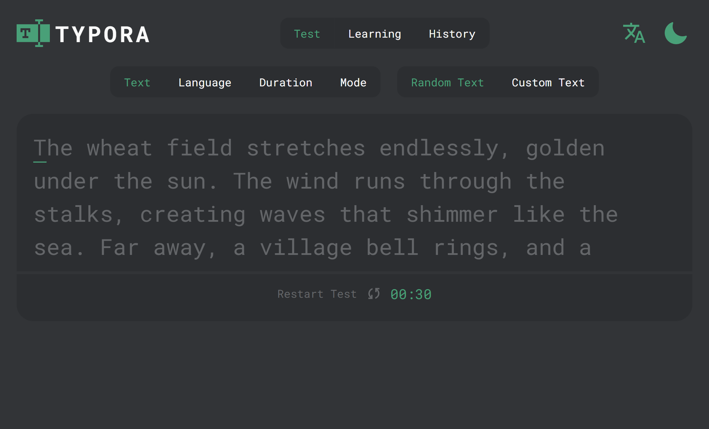
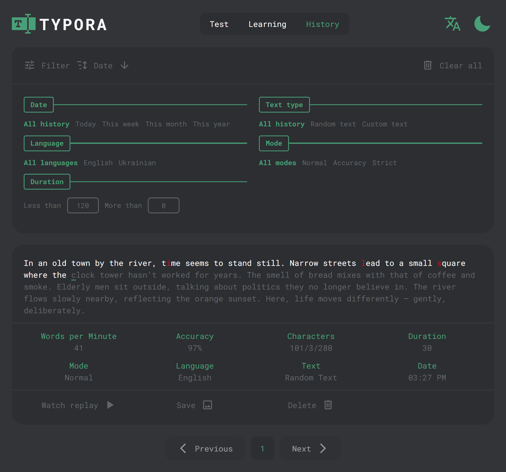

# About Typora

[**Typora**](https://andrii-kaliuha.github.io/typora/) is a web app for improving typing skills. Users can practice typing in different modes, watch replays of their sessions to see their mistakes, and keep track of their progress with a detailed result history.

## 📷 Screenshots

<div align="center">
  <h3>Test Page</h3>
  

  <h3>History Page</h3>
  

</div>

## ✨ Features

- **Typing Metrics** — Real-time speed and accuracy tracking
- **Performance Replay** — Watch and analyze your typing sessions
- **Different Modes** — Normal, Strict, and Accuracy training modes
- **Custom Settings** — Choose duration, language, or custom text
- **Detailed History** — Save results with filters and pagination
- **Visual Sharing** — Save result statistics as an image

## 🛠️ Tech Stack

- **Frontend:** React, TypeScript
- **State Management:** Redux Toolkit
- **Styling:** CSS
- **Localization:** react-i18next
- **Build Tooling:** Vite

## 📁 Project Structure

```text

src/
├── components/
│   ├── Filter/        # Filter by duration and other params
│   ├── Header/        # App header and navigation
│   ├── History/       # History list, controls and pagination
│   ├── Shared/        # Reusable UI components (Modals, Buttons)
│   ├── Sort/          # Sorting controls and custom selects
│   └── Test/          # Typing test UI and result display
├── pages/
│   ├── HistoryPage/   # Results history view
│   ├── LearningPage/  # Learning/practice mode view
│   └── TestPage/      # Main typing test view
├── hooks/             # Custom React hooks
├── store/             # Redux Toolkit slices and selectors
├── locales/
│   ├── i18n/          # UI translations (EN, UA)
│   └── texts/         # Typing texts (EN, UA)
├── types/             # TypeScript types
├── utils/             # Helper functions (formatters, storage, typing)
├── App.tsx
├── main.tsx
└── index.css

```

## ⚙️ Installation & Setup

```bash
# Clone the repository
git clone https://github.com/andrii-kaliuha/typora.git

# Go to project folder
cd typora

# Install dependencies
npm install

# Run development server
npm run dev
```

## 📦 Build

```bash
npm run build
```

## 🚀 Future Improvements

- **Charts:** Add typing statistics visualization with Chart.js
- **Offline Support:** PWA support with IndexedDB for local storage
- **Architecture:** Migrate to Feature-Sliced Design (FSD)
